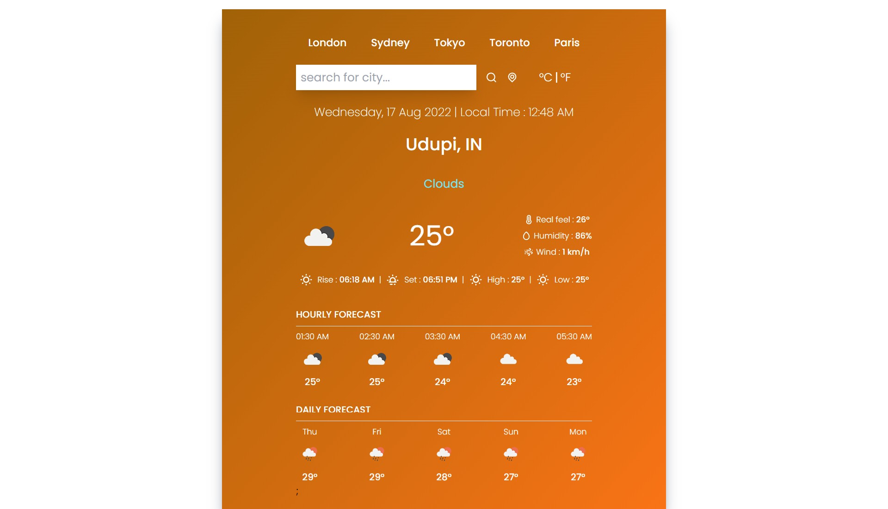

<h1 align="center">Weather App</h1> 
<br/>



<br/>
<h2 align="center">Web application to show the current and upcoming week weather forecast.</h2> 

<br/>

<h3 align="center"><a href="https://incandescent-toffee-012bd4.netlify.app/"><strong>Want to see live preview »</strong></a></h3>

<br/>

This project is about building a web application to show a weather forecast using weather API from external services [Open weather map](https://openweathermap.org/). Here you will be able to search for a specific location in the world and also it will automatically detect your current location in the beginning (for that you need to allow location) and will display all the important weather details.

It has some cool features like you can search for weather details according to the city names, detect your current location for displaying weather data, show the weather details in both degree celcius and fahrenheit temperatures, sync data to get the latest updated details of the current weather, toaster notification for every action, shows hourly weather forecast of the selected city for the next 5 hours and daily forecast for the next 5 days. It also has a feature to change the background colour of the application based on hot or cold temperature regions.

To use the app, type a name of the city and click on search or else click on the Your location weather button.

## 🚀 Features
- Search weather details according to the city
- Detect your current location for displaying weather data
- Sync data to get the latest updated details of the current weather
- Toast notification for every action
- Shows details in both degree celius and fahrenheit
- Shows hourly weather forecast for the next 5 hours
- Shows daily weather forecast for the next 5 days
- Changes background colour based on hot or cold temperature regions


<br/>


## Run Locally

Pre-Requisite : 
VS Code

Clone the project

```bash
#   https://github.com/aakarsh604/React_WeatherApp.git
```

<br/>

### Tools used on this project

- Visual Studio Code
- Heroku

<br/>


© 2022 Aakarsh Devadiga

## Show your support

Give a ⭐️ if you like this project!
